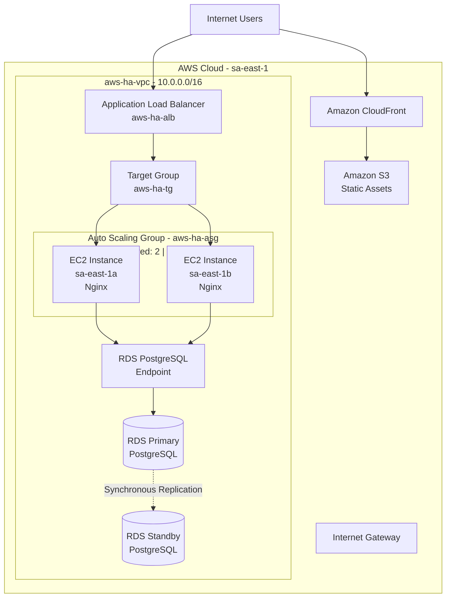

# AWS Highly Available Web Architecture



## Traffic Flow

The architecture separates dynamic application traffic from static-content delivery.

### Dynamic Application Traffic

1. Users send HTTP requests to the Application Load Balancer.
2. The ALB forwards requests to `aws-ha-tg`.
3. The target group distributes traffic across healthy EC2 instances.
4. The EC2 instances are managed by `aws-ha-asg`.
5. The Auto Scaling Group maintains at least two instances and can scale up to four.
6. Application instances connect to PostgreSQL using the RDS database endpoint.

The dynamic application path is:

`Internet → ALB → Target Group → EC2 → RDS Endpoint → PostgreSQL`

### Static Content Traffic

Static assets such as images are stored in Amazon S3.

Users retrieve these assets through Amazon CloudFront.

The static-content path is:

`Internet → CloudFront → S3`

CloudFront caches content at edge locations closer to users, reducing latency
and reducing repeated requests to the S3 origin.

The S3 bucket remains protected from direct public access while CloudFront is
used as the content-delivery layer.

## High Availability

The architecture avoids reliance on a single EC2 instance or Availability Zone.

The Auto Scaling Group distributes application instances across:

- `sa-east-1a`
- `sa-east-1b`

If an application instance becomes unhealthy, the Application Load Balancer
stops routing normal traffic to that target.

The Auto Scaling Group launches a replacement instance when capacity falls
below the configured desired level.

This behavior was tested by terminating an Auto Scaling-managed EC2 instance
and verifying that a replacement instance was automatically created.

## Database High Availability

Amazon RDS PostgreSQL is configured with Multi-AZ enabled.

The application connects using a single RDS endpoint.

Behind that endpoint, Amazon RDS maintains:

- A primary PostgreSQL DB instance
- A synchronous standby DB instance in another Availability Zone

The replication relationship is:

`Primary RDS → synchronous replication → Standby RDS`

If the primary database instance or its Availability Zone becomes unavailable,
Amazon RDS can fail over to the standby.

The application continues using the database endpoint instead of connecting
directly to either database instance.

The standby is used for high availability and failover, not for normal
read-scaling workloads.

## Auto Scaling

The Auto Scaling Group is configured with:

| Setting | Value |
|---|---:|
| Minimum capacity | 2 |
| Desired capacity | 2 |
| Maximum capacity | 4 |
| Scaling policy | Target tracking |
| Metric | Average CPU utilization |
| Target | 70% |

This allows the compute tier to automatically increase capacity when demand
rises and reduce capacity when demand falls.

The architecture therefore demonstrates both:

- Scalability
- Elasticity

## Load Balancing

The Application Load Balancer distributes requests across healthy application
instances.

Testing confirmed that requests to the same ALB DNS endpoint were served by
different backend instances.

Example responses included:

```text
Served by: ip-10-0-1-x
Served by: ip-10-0-2-x
```

This demonstrates traffic distribution across multiple Availability Zones.

## Static Asset Delivery

Amazon S3 stores static application objects outside the EC2 compute layer.

This prevents static content from being tied to individual application servers
and supports a more stateless compute design.

Amazon CloudFront is configured with the S3 bucket as its origin.

A test image stored in S3 was successfully retrieved through the CloudFront
distribution over HTTPS.

This verified the path:

`Client → CloudFront → S3`

## Security

The architecture uses separate security groups for different tiers.

### Application Load Balancer

The ALB accepts public web traffic.

### Application Instances

EC2 instances accept HTTP application traffic from the ALB security group
rather than directly from the public internet.

### Database

Amazon RDS is not publicly accessible.

PostgreSQL access is restricted to the application tier.

### S3

The S3 bucket is not intended to be directly publicly accessible.

CloudFront provides the public content-delivery path to static objects.

This creates controlled traffic flows:

`Internet → ALB → EC2`

and:

`Internet → CloudFront → S3`

rather than exposing backend infrastructure directly.

## Current Architecture Summary

```text
                        Internet Users
                         /           \
                        /             \
                       v               v
              Application ALB      CloudFront
                      |                 |
                      v                 v
                Target Group           S3
                 /       \
                v         v
             EC2-A       EC2-B
              AZ-A        AZ-B
                \         /
                 \       /
                  v     v
                 RDS Endpoint
                      |
                      v
                 RDS Primary
                      |
             synchronous replication
                      |
                      v
                 RDS Standby
                 different AZ
```

## Production Improvements

The following improvements would make the architecture stronger for a
production environment:

- Move application EC2 instances into private subnets
- Add controlled outbound connectivity using NAT Gateway or VPC endpoints
- Enable HTTPS on the ALB using AWS Certificate Manager
- Redirect HTTP traffic to HTTPS
- Add Route 53 with a custom domain
- Add AWS WAF in front of public application traffic
- Add CloudWatch alarms and dashboards
- Centralize application logs
- Store application credentials in AWS Secrets Manager
- Use a dedicated RDS DB subnet group containing only private subnets
- Enable Infrastructure as Code using Terraform or CloudFormation
