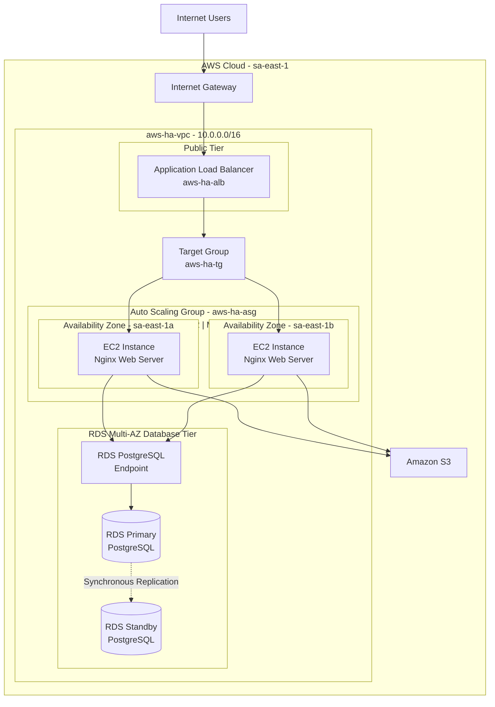

# AWS Highly Available Web Architecture

## Traffic Flow

1. Users send HTTP requests to the Application Load Balancer.
2. The ALB receives internet traffic across multiple Availability Zones.
3. The ALB forwards requests to `aws-ha-tg`.
4. The target group distributes requests across healthy EC2 instances.
5. EC2 instances are managed by `aws-ha-asg`.
6. The Auto Scaling Group maintains at least two instances and can scale to four.
7. Application instances connect to PostgreSQL through the RDS endpoint.
8. RDS maintains a synchronous standby database in another Availability Zone.
9. RDS is not publicly accessible.
10. Application instances can use Amazon S3 for object storage.

## High Availability

The architecture avoids reliance on a single EC2 instance or Availability Zone.

The Auto Scaling Group distributes application instances across:

- `sa-east-1a`
- `sa-east-1b`

If an application instance becomes unhealthy, the Application Load Balancer
stops routing traffic to that instance.

The Auto Scaling Group can launch a replacement instance to maintain the
configured desired capacity.

### Database High Availability

Amazon RDS PostgreSQL is configured with **Multi-AZ enabled**.

RDS maintains a synchronous standby database in another Availability Zone.

If the primary database instance or its Availability Zone becomes unavailable,
Amazon RDS can automatically fail over to the standby database.

Applications continue connecting through the RDS database endpoint rather than
connecting directly to either the primary or standby instance.

The standby database is used for **high availability and failover**, not for
serving normal application read traffic.

## Scaling

The Auto Scaling Group is configured with:

| Setting | Value |
|---|---:|
| Minimum capacity | 2 |
| Desired capacity | 2 |
| Maximum capacity | 4 |
| Scaling metric | Average CPU utilization |
| Target | 70% |

This allows the application tier to automatically increase or decrease capacity
based on demand.

## Security

The architecture uses separate security groups for the application tiers.

- The ALB accepts public web traffic.
- EC2 instances accept application traffic from the ALB security group.
- RDS is not publicly accessible.
- PostgreSQL access is restricted to the application tier.
- The Multi-AZ standby is managed internally by Amazon RDS.

The intended application traffic path is:

`Internet → ALB → Target Group → EC2 → RDS Endpoint → PostgreSQL`

This prevents the database from being directly exposed to the internet.
